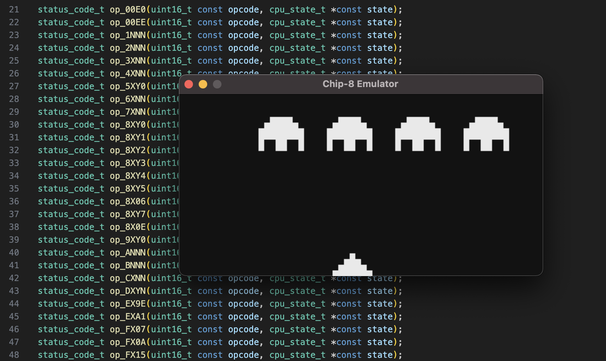

# CHIP-8 Emulator

A simple emulator for the Chip-8 interpreter written from scratch in C.
This project is for educational purpose as a learning opportunity for me to get into emulator development.
<div align="center">
  
</div>
<div align="center">
  <h1 style="font-weight: bold; font-size: 64px">
    👾🕹️👾
  </h1>
</div>

## CHIP-8 Specifications

- 4 KiB memory
- 16 8-bit registers (V registers)
- 16 16-bit stack
- 1 16-bit index register
- 64x32 pixels graphics
- 16-key input keypad
- Delay timer
- Sound timer

# Dependencies

- [Simple DirectMedia Layer (SDL) 2.0](https://wiki.libsdl.org/SDL2/FrontPage): Graphics and keyboard input
- [Ceedling](https://www.throwtheswitch.org/ceedling) + [gcovr](https://github.com/gcovr/gcovr): Unit testing

# Building + Running

```sh
make
./bin/chip8_emu.out <path_to_rom.ch8>
```

# Testing

```sh
./run_test.sh
```

Should run all of the commands needed to run unit tests and generate coverage report.

# Additional Resources

- [Tobias V. Langhoff's CHIP-8 Emulator Guide](https://tobiasvl.github.io/blog/write-a-chip-8-emulator/)
- [Austin Morlan's CHIP-8 Emulator Guide (C++)](https://austinmorlan.com/posts/chip8_emulator/)
- [Timendus's CHIP-8 Test Suite](https://github.com/Timendus/chip8-test-suite)
- [Repository of CHIP-8 ROMs by dmatlack](https://github.com/dmatlack/chip8)
- [CHIP-8 Archive by johnearnest](https://johnearnest.github.io/chip8Archive/)